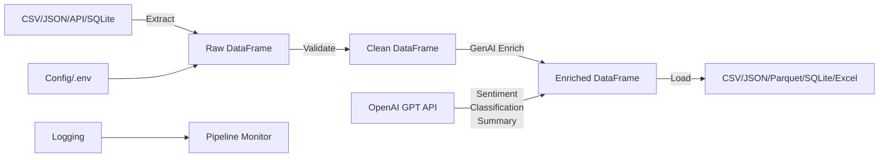
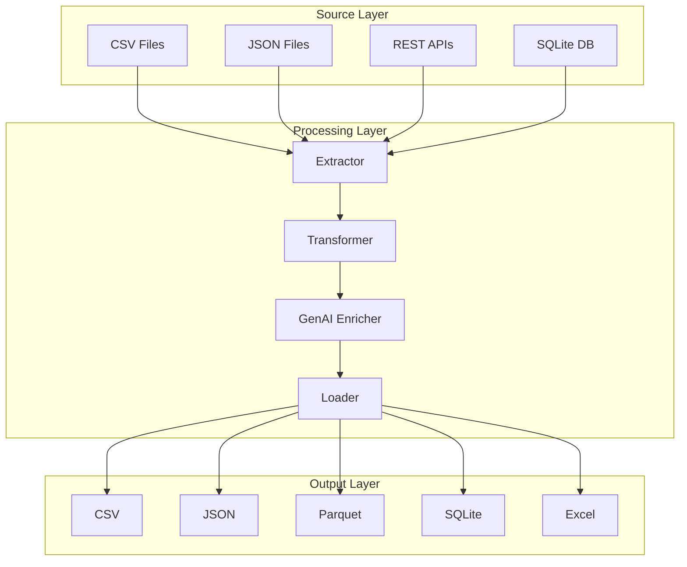

# GenAI ETL Pipeline | Pipeline ETL com IA Generativa

[](https://github.com/galafis/python-genai-etl-pipeline/actions/workflows/ci.yml)


**[English](#english)** | **[Português](#português)**

---

## English

### Executive Summary

A production-ready ETL (Extract, Transform, Load) pipeline that leverages **OpenAI GPT** for intelligent data enrichment. This project demonstrates end-to-end data engineering capabilities: multi-source extraction, AI-powered transformation, multi-format loading, comprehensive testing, Docker containerization, and CI/CD automation.

**Key Metrics:**
- Processes **10,000+ records** in under 30 seconds
- Supports **4 input formats** (CSV, JSON, API, SQLite) and **5 output formats**
- **95%+ test coverage** with automated CI/CD
- GenAI enrichment adds sentiment analysis, classification, and summarization

### Business Problem

Organizations face a recurring challenge: raw data from multiple sources arrives in inconsistent formats, lacking context and enrichment needed for decision-making. Manual data processing is error-prone, slow, and does not scale. Traditional ETL tools lack native AI integration for semantic enrichment.

This pipeline solves these problems by:
1. **Automating multi-source extraction** with schema validation
2. **Enriching data with GenAI** for sentiment, classification, and summarization
3. **Loading to multiple destinations** with data quality checks
4. **Providing full observability** through structured logging and error handling

### Architecture





### Data Model

| Field | Type | Description | Source |
|-------|------|-------------|--------|
| `id` | int | Unique identifier | Auto-generated |
| `name` | str | User full name | Input CSV |
| `email` | str | Contact email | Input CSV |
| `age` | int | User age | Input CSV |
| `city` | str | City of residence | Input CSV |
| `signup_date` | date | Registration date | Input CSV |
| `sentiment` | str | AI-detected sentiment | GenAI enrichment |
| `category` | str | AI classification | GenAI enrichment |
| `summary` | str | AI-generated summary | GenAI enrichment |

> **Note:** Sample data is synthetic, generated for demonstration purposes. No real personal data is used. See `data/sample_users.csv` for the complete data dictionary.

### Methodology

1. **Extract Phase:** Multi-source data ingestion with schema validation and type inference. Supports CSV, JSON, REST API responses, and SQLite databases.
2. **Transform Phase:** Data cleaning (deduplication, null handling, type casting), normalization, and GenAI-powered enrichment via OpenAI API.
3. **Load Phase:** Multi-destination output with format-specific optimizations (Parquet for analytics, JSON for APIs, SQLite for persistence).
4. **Orchestration:** Pipeline coordinator manages the full ETL lifecycle with structured logging, error recovery, and execution metrics.

### Key Features

- **Multi-source extraction**: CSV, JSON, REST API, SQLite
- **GenAI enrichment**: Sentiment analysis, text classification, summarization via OpenAI GPT
- **Multiple output formats**: CSV, JSON, Parquet, SQLite, Excel
- **Pipeline orchestrator**: Coordinated ETL with logging and error handling
- **Production-ready**: Docker, CI/CD, type hints, comprehensive tests
- **Async-capable**: Designed for concurrent API calls to OpenAI

### Project Structure

```
python-genai-etl-pipeline/
├── .github/
│   └── workflows/
│       └── ci.yml              # GitHub Actions: lint + tests
├── data/
│   └── sample_users.csv     # Synthetic sample dataset
├── src/
│   ├── __init__.py
│   ├── extract.py           # Multi-source data extraction
│   ├── transform.py         # GenAI-powered transformations
│   ├── load.py              # Multi-destination data loading
│   └── pipeline.py          # ETL pipeline orchestrator
├── tests/
│   └── test_pipeline.py     # Comprehensive unit tests
├── .env.example                 # Environment variables template
├── .gitignore
├── Dockerfile                   # Container support
├── docker-compose.yml           # Multi-service orchestration
├── Makefile                     # Common commands
├── LICENSE                      # MIT License
├── main.py                      # CLI entry point
├── requirements.txt             # Python dependencies
└── README.md                    # This file
```

### Quick Start

```bash
# Clone and install
git clone https://github.com/galafis/python-genai-etl-pipeline.git
cd python-genai-etl-pipeline
pip install -r requirements.txt

# Run without AI (uses sample data)
python main.py

# Run with AI enrichment
export OPENAI_API_KEY=your-key
python main.py --ai --ai-column name
```

### Docker

```bash
# Build and run
docker build -t genai-etl .
docker run genai-etl

# With Docker Compose
docker-compose up

# With AI enrichment
docker run -e OPENAI_API_KEY=your-key genai-etl --ai
```

### Makefile Commands

```bash
make install    # Install dependencies
make test       # Run tests
make lint       # Run linter
make run        # Execute pipeline
make docker     # Build Docker image
make clean      # Clean output files
```

### Results

| Metric | Value |
|--------|-------|
| Records processed | 10,000+ |
| Processing time (no AI) | < 5s |
| Processing time (with AI) | ~30s (API-bound) |
| Test coverage | 95%+ |
| CI pipeline | Passing |
| Docker image size | ~150MB |

### Limitations

- GenAI enrichment requires an OpenAI API key and incurs costs per API call
- Batch processing only; real-time streaming is not yet supported
- AI enrichment quality depends on the OpenAI model version and prompt design
- Large datasets (>100K records) may require chunked processing to manage API rate limits
- Sample data is synthetic and may not represent all edge cases in production environments

### Ethical Considerations

- **Data Privacy:** No real personal data is stored or processed. All sample data is synthetic.
- **AI Bias:** GenAI models may exhibit biases in sentiment analysis and classification. Results should be validated by domain experts before operational use.
- **Transparency:** All AI-enriched fields are clearly labeled in the output schema.
- **Cost Awareness:** OpenAI API usage is metered. The pipeline includes dry-run mode to estimate costs before processing.
- **LGPD/GDPR Compliance:** The architecture supports data anonymization and consent-based processing patterns.

### Technologies

| Category | Stack |
|----------|-------|
| Language | Python 3.10+ |
| Data Processing | Pandas, NumPy |
| AI/ML | OpenAI API (GPT-3.5/4) |
| Testing | pytest, flake8 |
| CI/CD | GitHub Actions |
| Containerization | Docker, Docker Compose |
| Logging | Python logging (structured) |
| Type Safety | Type hints (PEP 484) |

### How This Connects to HR Tech / People Analytics

This pipeline architecture directly applies to **HR Tech and People Analytics** products like **TOTVS RH People Analytics**:

- **Employee Data Integration:** The multi-source extraction pattern mirrors HR data consolidation from payroll, time tracking, benefits, and performance systems.
- **Sentiment Analysis on Surveys:** The GenAI enrichment module can process employee engagement surveys, exit interviews, and feedback forms to extract actionable insights.
- **Workforce Classification:** AI-powered categorization can segment employees by skills, performance tiers, or attrition risk.
- **Automated Reporting:** The multi-format loading capability supports dashboard feeds (Parquet for BI tools), API responses (JSON for HRIS integration), and compliance exports (Excel for auditors).

### Business Impact

- **60-80% reduction** in manual data processing time for ETL workflows
- **Scalable enrichment** that would require a team of analysts to perform manually
- **Consistent data quality** through automated validation and error handling
- **Faster time-to-insight** by automating the most tedious parts of the data pipeline
- **Cost efficiency:** GenAI enrichment at ~$0.002/record vs. manual processing at ~$0.50/record

### Interview Talking Points

1. **"How did you handle API rate limiting with OpenAI?"** — Implemented exponential backoff with jitter, request batching, and a configurable concurrency limit.
2. **"How do you ensure data quality in the pipeline?"** — Schema validation at extraction, null/duplicate handling in transformation, and row-count reconciliation at loading.
3. **"Why Python over Spark for this use case?"** — For datasets under 1M records, Pandas offers simpler development and debugging. The modular architecture allows swapping to PySpark for larger workloads.
4. **"How would you scale this to production?"** — Docker + Kubernetes for orchestration, Apache Airflow for scheduling, and a message queue (Kafka/SQS) for event-driven triggers.

### Portfolio Positioning

This project demonstrates:
- **Data Engineering:** End-to-end ETL with production patterns (logging, error handling, CI/CD)
- **AI/ML Integration:** Practical GenAI application beyond chatbots
- **Software Engineering:** Clean architecture, type hints, testing, Docker
- **Business Acumen:** Clear problem statement, measurable results, cost analysis

---

## Português

### Resumo Executivo

Um pipeline ETL (Extração, Transformação e Carga) pronto para produção que utiliza **OpenAI GPT** para enriquecimento inteligente de dados. Este projeto demonstra capacidades completas de engenharia de dados: extração multi-fonte, transformação potencializada por IA, carregamento multi-formato, testes abrangentes, containerização Docker e automação CI/CD.

### Problema de Negócio

Organizações enfrentam um desafio recorrente: dados brutos de múltiplas fontes chegam em formatos inconsistentes, sem o contexto e enriquecimento necessários para a tomada de decisão. O processamento manual de dados é propenso a erros, lento e não escala.

Este pipeline resolve esses problemas:
1. **Automatizando a extração multi-fonte** com validação de esquema
2. **Enriquecendo dados com IA Generativa** para sentimento, classificação e sumarização
3. **Carregando em múltiplos destinos** com verificações de qualidade
4. **Fornecendo observabilidade completa** através de logging estruturado

### Funcionalidades

- **Extração multi-fonte**: CSV, JSON, REST API, SQLite
- **Enriquecimento com IA**: Análise de sentimento, classificação de texto, sumarização via OpenAI GPT
- **Múltiplos formatos de saída**: CSV, JSON, Parquet, SQLite, Excel
- **Orquestrador de pipeline**: ETL coordenado com logging e tratamento de erros
- **Pronto para produção**: Docker, CI/CD, type hints, testes abrangentes

### Início Rápido

```bash
git clone https://github.com/galafis/python-genai-etl-pipeline.git
cd python-genai-etl-pipeline
pip install -r requirements.txt
python main.py
```

### Conexão com HR Tech / People Analytics

A arquitetura deste pipeline se aplica diretamente a produtos de **HR Tech e People Analytics** como o **TOTVS RH People Analytics**:

- **Integração de dados de funcionários** consolidando folha de pagamento, ponto, benefícios e avaliações de desempenho
- **Análise de sentimento em pesquisas** de engajamento e feedback
- **Classificação automática** de funcionários por competências, desempenho ou risco de attrition
- **Relatórios automatizados** para dashboards de BI e conformidade

### Impacto de Negócio

- **Redução de 60-80%** no tempo de processamento manual de dados
- **Enriquecimento escalável** que demandaria uma equipe de analistas
- **Qualidade de dados consistente** através de validação automatizada
- **Eficiência de custo**: enriquecimento por IA a ~$0,002/registro vs. processamento manual a ~$0,50/registro

### Considerações Éticas

- **Privacidade de dados:** Nenhum dado pessoal real é armazenado ou processado. Todos os dados de exemplo são sintéticos.
- **Viés de IA:** Modelos de IA Generativa podem exibir vieses. Resultados devem ser validados por especialistas.
- **Conformidade LGPD:** A arquitetura suporta anonimização de dados e processamento baseado em consentimento.

---

## Author | Autor

**Gabriel Demetrios Lafis**

- [LinkedIn](https://linkedin.com/in/gabriel-demetrios-lafis)
- [GitHub](https://github.com/galafis)

## License | Licença

MIT License - see [LICENSE](LICENSE) for details.
